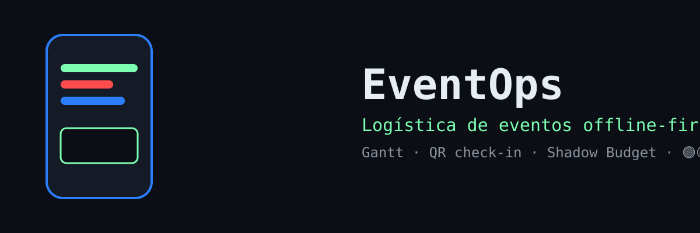
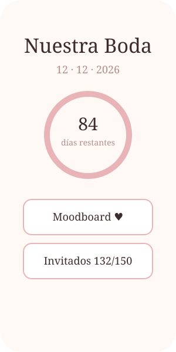
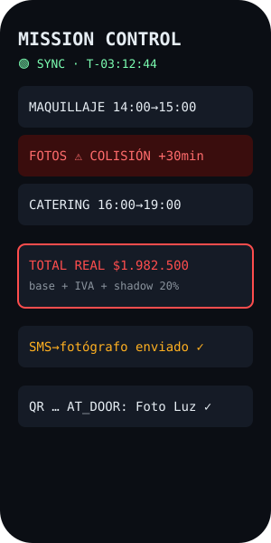
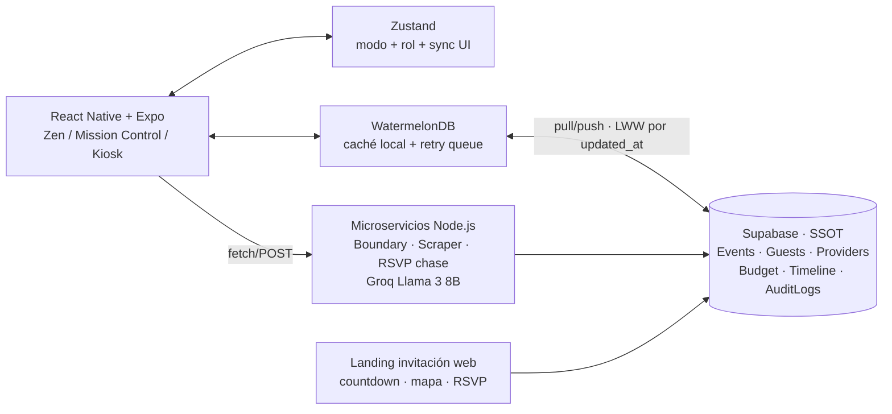

<p align="center">
  
</p>
<h1 align="center">EventOps — Logística de Eventos Offline-First</h1>

<p align="center">
  <a href="https://github.com/rechimonth/eventops/actions"></a>
</p>

<p align="center">
  <strong>Un ERP de logística para bodas y eventos masivos: Gantt en tiempo real, check-in de proveedores por QR y presupuestos con imprevistos, funcionando sin Wi-Fi en el salón.</strong>
</p>

<p align="center">
  
</p>

## Pantallas

| Zen (planificación) | Mission Control (día del evento) | Kiosk (invitados) |
|---|---|---|
|  |  |  |

## Demo en 3 minutos (sin backend)

```powershell
npm install --prefer-offline --no-audit --no-fund --legacy-peer-deps
$env:EXPO_PUBLIC_USE_MOCKS = "true"
npx expo start
```

Con `EXPO_PUBLIC_USE_MOCKS=true` la app usa datos locales (15 invitados, 3 proveedores, Gantt demo). Sin Supabase, sin keys, sin red. Escanea el QR con Expo Go.

## Arquitectura



## El diferencial: red hostil por diseño

**Problema 1 — el build local moría por timeout.** El `npm install` de Expo no terminaba con red inestable. Solución: `scripts/setup.ps1` resiliente (caché agresivo, 3 reintentos, fallback pnpm/yarn) + **CI que compila por nosotros**: `.github/workflows/build.yml` (`npm ci` → `test:logic` → `typecheck` → `eas build preview`). Solo hace falta red para `git push`.

**Problema 2 — el Wi-Fi del salón falla el día del evento.** Solución offline-first real: WatermelonDB como fuente local, **prohibido el DELETE** (soft delete `is_deleted`), conflictos **Last-Write-Wins** por `updated_at`, y **dead-letter queue con exponential backoff** (3 min · 2ⁿ, 24 intentos). Semáforo en UI: 🟢 Sincronizado · 🟡 Guardado Local · 🔴 Error de Sync.

## Módulos

| Módulo | Qué hace |
|---|---|
| Logistics Engine | Gantt que recalcula dependientes y marca colisiones; si maquillaje +30 min, avisa al fotógrafo |
| Shadow Budgeting | +20 % imprevistos + IVA real por gasto (`src/logistics/budget.ts`) |
| QR Check-in | Proveedores avanzan `pending → … → load_in → live → load_out → done` |
| Cotizador Inverso | Briefing estandarizado (texto + PDF + link) que obliga al proveedor a responder si entra en presupuesto |
| Info Diet | Roles: presupuesto y timeline interno ocultos a familia/invitados |
| Seating Plan | Asignación a mesas con control de sobrecupo (misma data en nativo y web) |
| Boundary Manager | 3 respuestas diplomáticas ante familiares/proveedores difíciles |
| WhatsApp Ops | Persigue RSVP pendientes; `"Voy, soy celíaco"` → DB vía `POST /rsvp` |

## Monorepo desktop (roadmap)

`apps/mobile` (Expo, actual) · `apps/desktop` (Vite + React + Tauri) · `packages/core-logic` (`syncEngine`, `dataClient`, `budget`, `gantt` compartidos al 100 %). El Dashboard consume `IStorageProvider` sin saber si corre en Android o Windows — ver `packages/core-logic/src/IStorageProvider.ts`.

## Scripts

| Comando | Uso |
|---|---|
| `npm run test:logic` | Jest: budget + gantt + backoff (corre en CI) |
| `npm run typecheck` | `tsc --noEmit` |
| `powershell scripts/verify.ps1` | Verificación sin dependencias |
| `powershell scripts/setup.ps1` | Instalación resiliente |
